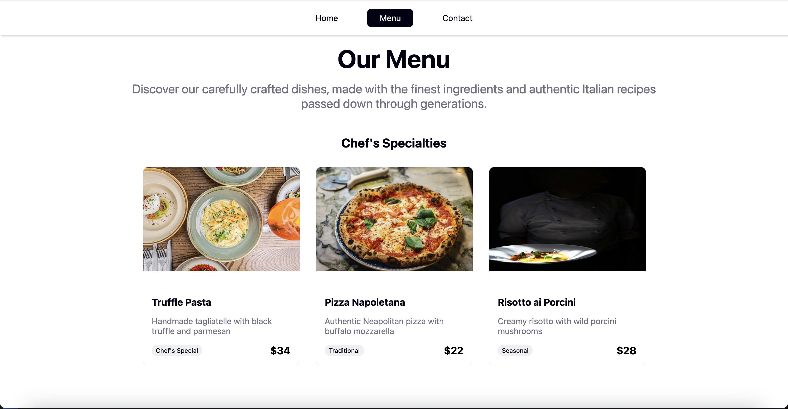
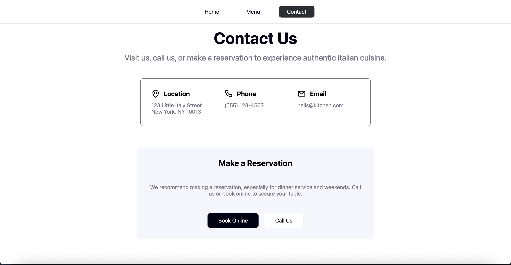

# Project: Restaurant Page

Live: <https://monatric.github.io/restaurant-page/>

This is a simple project for JavaScript, a restaurant page [guided by The Odin Project](hhttps://www.theodinproject.com/lessons/javascript-restaurant-page). The primary focus of the learning outcomes here are npm, Webpack, classes, and ES6 modules.

## Learning Outcomes

- Used npm to install libraries I needed.
- Configured Webpack manually for handling different assets and development tools.
- Used classes to build repeating UI like menu cards.
- Used ES6 imports and exports and used an entry point for handling these scripts

## Screenshots

### Home

### Menu

### Contact

